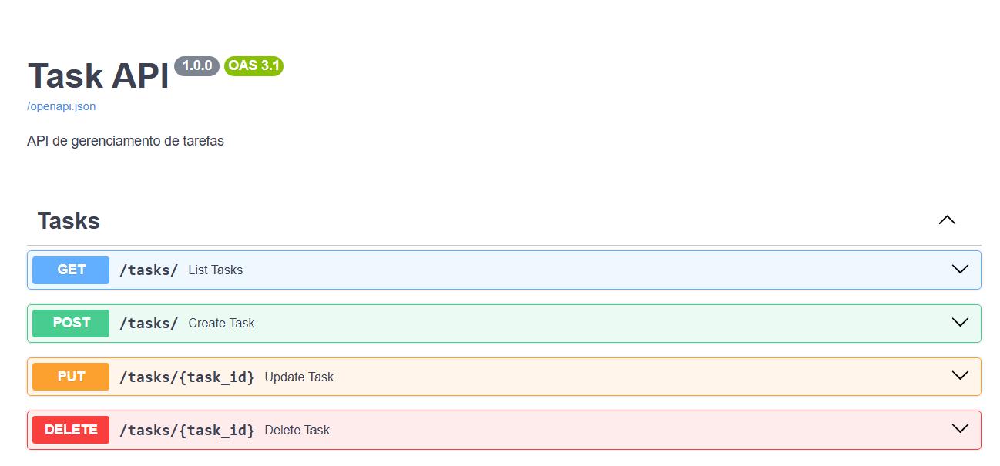

# Task API - FastAPI

API REST para gerenciamento de tarefas desenvolvida com FastAPI, SQLAlchemy e SQLite.

## Tecnologias

* Python 3.13
* FastAPI
* SQLAlchemy
* SQLite
* Uvicorn

## Funcionalidades atuais

* API REST
* Documentação Swagger
* Banco SQLite
* Modelo de tarefas
* Criação automática de tabelas
* Criar tarefa
* Listar tarefas
* Atualizar tarefa
* Deletar tarefa
* Filtros por prioridade e statu




## Como executar

```bash
pip install -r requirements.txt
uvicorn app.main:app --reload
```

## Endpoints

* `GET /`
* `GET /docs`

## Próximos passos


